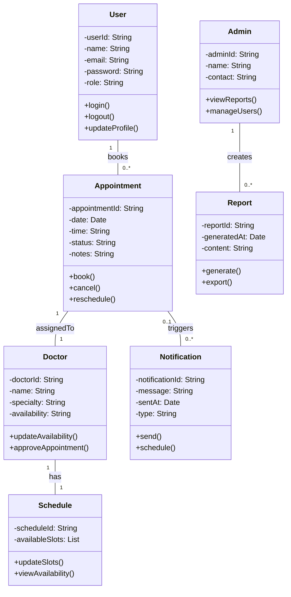

# 🧱 Class Diagram – Smart Appointment Scheduling System

---

### 🧠 Explanation of Design Decisions

- Chose **composition** for Doctor → Schedule (a doctor manages their own availability).
- Appointment is the central class, linked to both **User** and **Doctor**.
- Added **Notification** class to reflect reminder logic from prior assignments.
- Admin role separated from User to follow SRP (Single Responsibility Principle).
- Used `List` as a type for available slots in `Schedule` for better real-time modeling.

