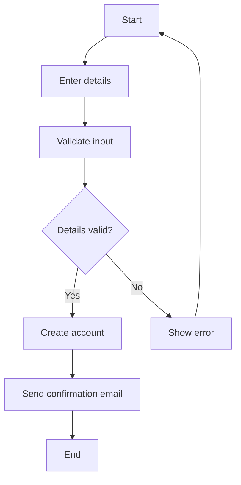
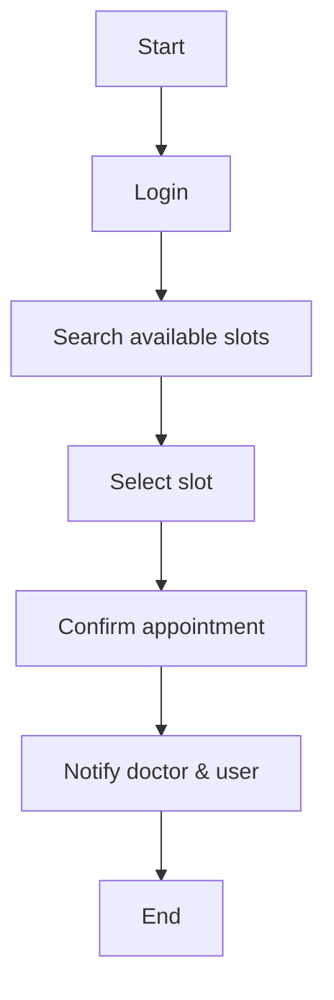
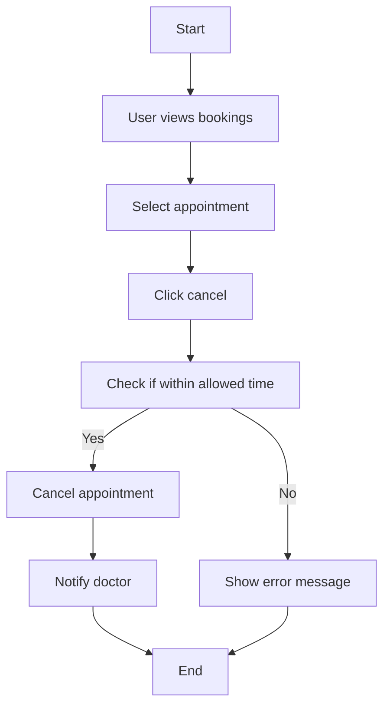
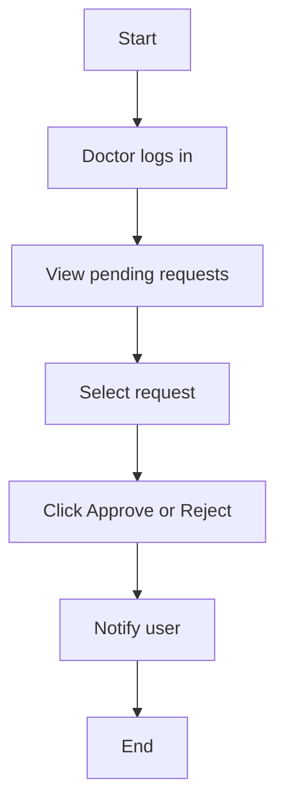
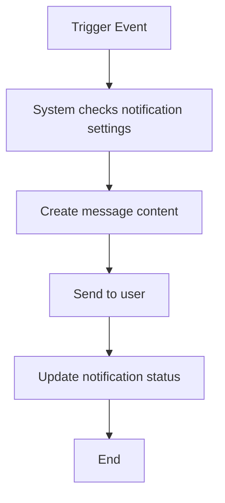
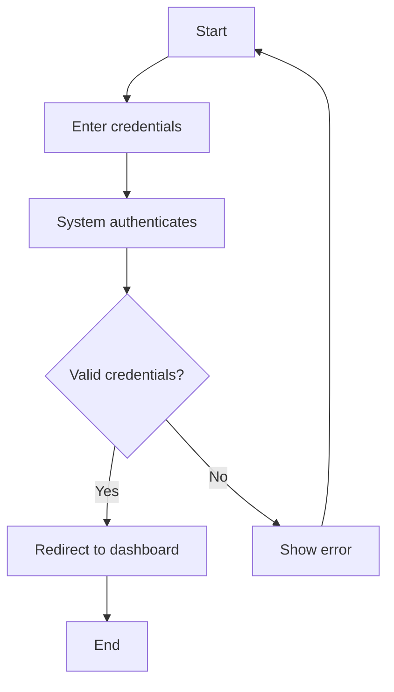
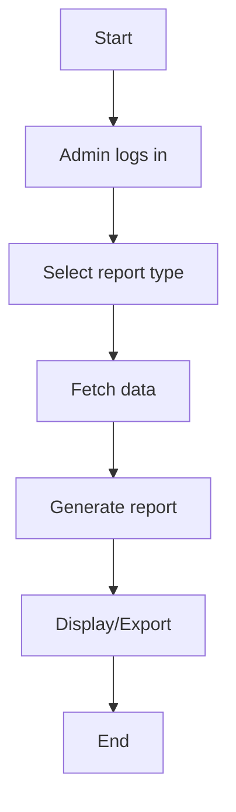
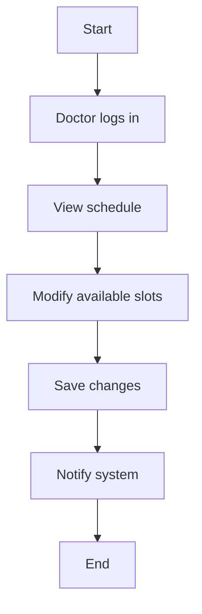

# 🧭 Activity Diagrams - Smart Appointment Scheduling System

---

## 1. User Registration

**Explanation:**  
Handles user onboarding. Supports *FR-002*. Ensures clean data and user confirmation.

---

## 2. Book Appointment

**Explanation:**  
Main workflow for booking. Links with *FR-001*, and *Use Case: Book Appointment*.

---

## 3. Cancel Appointment

**Explanation:**  
Includes rules around cancellation time (e.g., 24 hours). Addresses *FR-005*.

---

## 4. Approve Appointment (Doctor)

**Explanation:**  
Supports admin/doctor workflows. Aligned with *FR-004*.

---

## 5. Send Notification

**Explanation:**  
Automated process for reminders, updates. Maps to *FR-006*.

---

## 6. System Login (User/Doctor/Admin)

**Explanation:**  
Common login flow. Relevant to multiple actors. Linked to *security NFR*.

---

## 7. Generate Report (Admin)

**Explanation:**  
Supports system monitoring. Linked to *Admin role use cases*.

---

## 8. Update Availability (Doctor)

**Explanation:**  
Ensures real-time slot management. Linked to *Doctor availability (FR-003)*.

---
