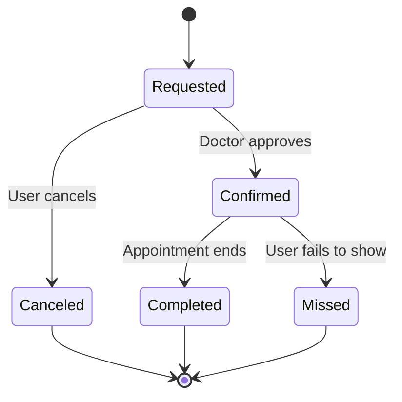
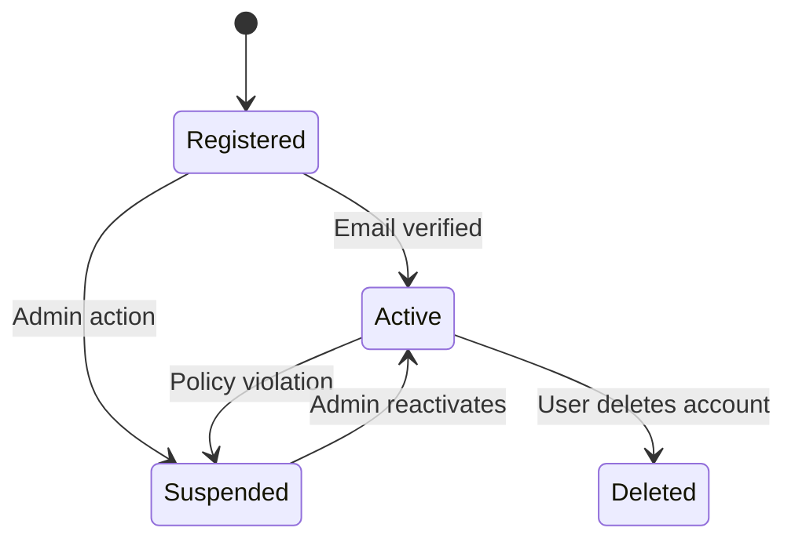
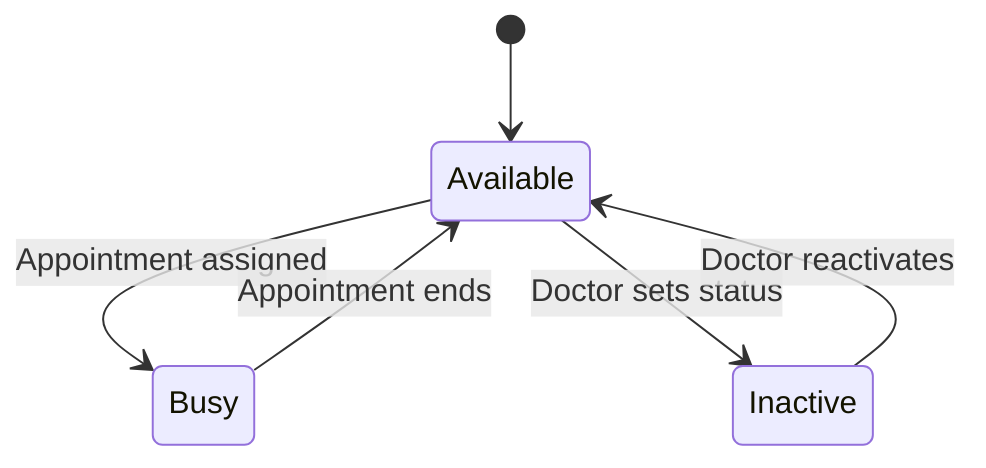
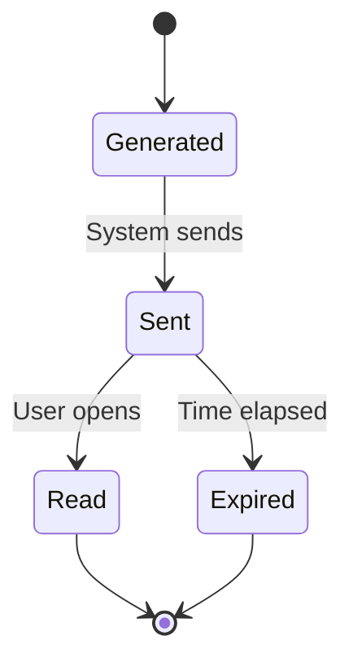
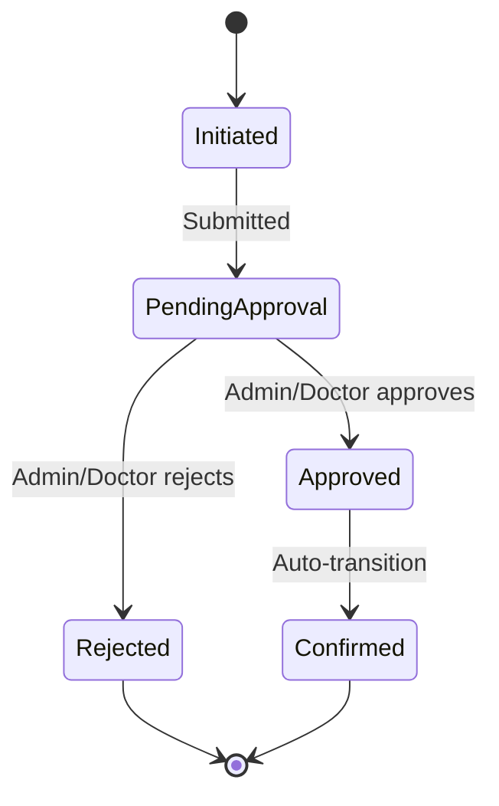
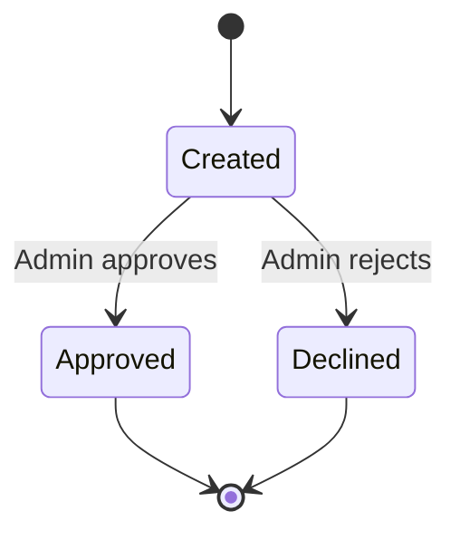
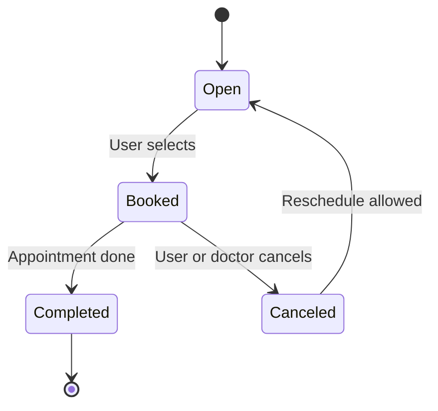

# 📘 State Transition Diagrams

Below are the state transition diagrams for critical objects in the Smart Appointment Scheduling System.

---

## 1. Appointment

**Explanation:**  
- **States:** Requested, Confirmed, Completed, Missed, Canceled  
- **Transitions:** Triggered by user or doctor actions.  
- **FR Mapping:** This addresses *FR-001: Users can request appointments* and *FR-005: Appointments can be cancelled.*

---

## 2. UserAccount

**Explanation:**  
- Shows lifecycle from registration to deletion.  
- **FR Mapping:** Aligns with *FR-002: User account lifecycle management.*

---

## 3. Doctor

**Explanation:**  
- Reflects doctor’s availability for appointments.  
- **FR Mapping:** Supports *FR-003: Doctors manage availability.*

---

## 4. Notification

**Explanation:**  
- Notifications lifecycle for events like confirmations.  
- **FR Mapping:** Matches *FR-006: Notifications for booking status.*

---

## 5. BookingRequest

**Explanation:**  
- Tracks booking approval lifecycle.  
- **FR Mapping:** Covers *FR-004: Admin/Doctor approval workflows.*

---

## 6. AdminApproval

**Explanation:**  
- Simple flow for admin approvals on slot or user requests.  
- **FR Mapping:** Supports *FR-004 and Sprint 2 US-05.*

---

## 7. ScheduleSlot

**Explanation:**  
- Represents a slot's availability lifecycle.  
- **FR Mapping:** Maps to *FR-003 and Agile Sprint 1 tasks.*

---
